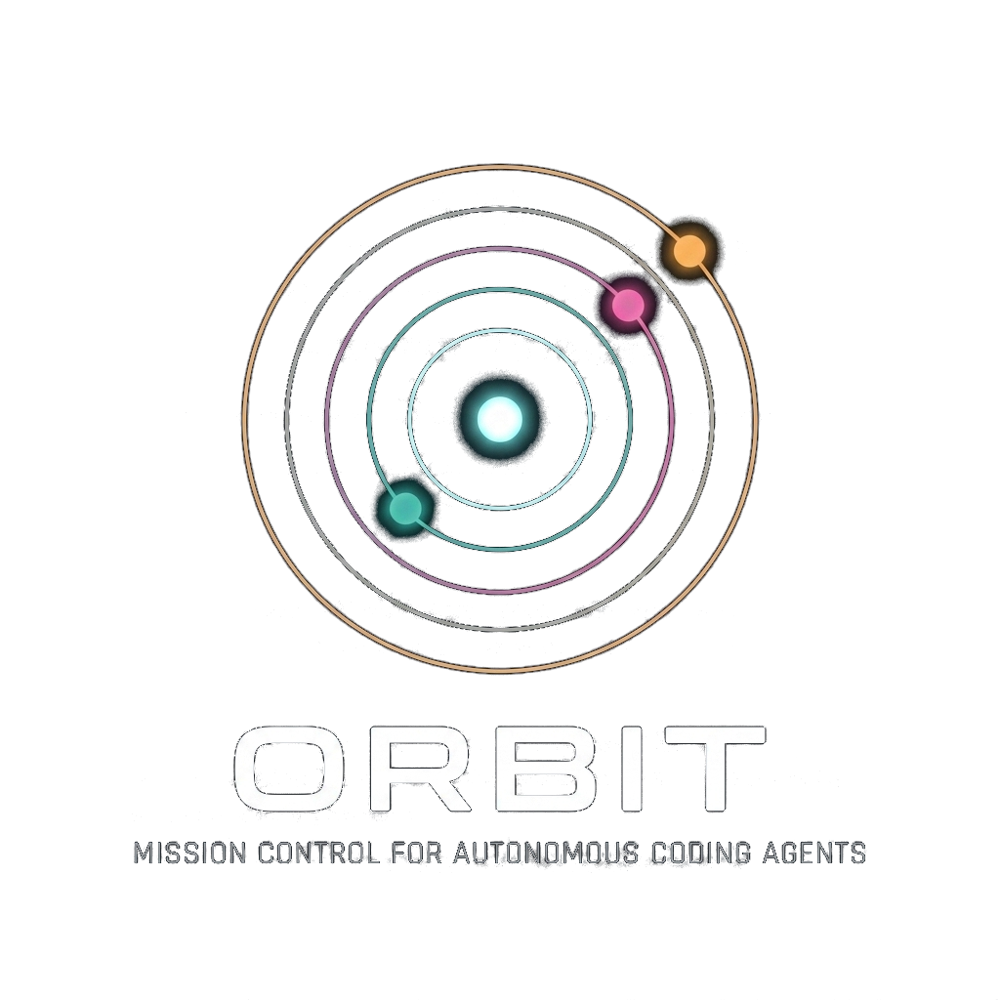
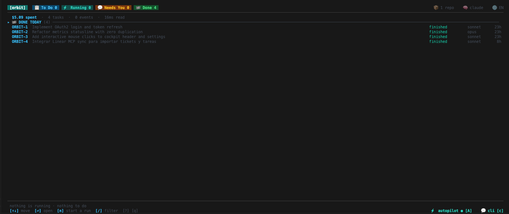

<div align="center">



*Supervise, steer, and verify multi-agent software development at terminal velocity.*

[](https://github.com/e1i0r/orbit/actions)
[](https://opensource.org/licenses/Apache-2.0)
[](https://go.dev)
[](https://charm.sh)

</div>

---

## ⚡ What is Orbit?

**Orbit** is a high-performance terminal flight deck (`TUI`) built to transform autonomous AI coding from an uncontrolled gamble into a **disciplined, production-grade engineering pipeline**.

While running raw CLI agents in standalone tabs quickly leads to branch pollution, silent failures, and burned API budgets, Orbit gives you **centralized command and real-time observability** over fleets of concurrent agents (**Claude Code**, **Codex**, **OpenCode**, and local models).

- 🌲 **Zero Working-Tree Pollution:** Every task executes inside an isolated, throwaway Git worktree.
- 🛡️ **Autonomous Gates & Human Sign-Offs:** Multi-stage pipelines (`plan` $\rightarrow$ `build` $\rightarrow$ `test` $\rightarrow$ `audit`) with automated test verification and mid-flight steering.
- 🔍 **Deep Flight Telemetry:** 11 real-time inspector tabs covering live Git diffs, chain-of-thought traces, token economics, tool refusals, and operator notes.



---

## ✨ Key Features

### 🎛️ 1. Interactive Terminal Cockpit
- **11 Detailed Inspector Tabs:**
  - **`1` Overview:** Summary status, duration, model, token expenditure, and active phase.
  - **`2` Flow:** Real-time visual tree of the task's execution pipeline.
  - **`3` Gates:** Automated test suites, lint checks, and pass/fail diagnostics.
  - **`4` Cost:** Monotonic real-time tracking of token usage and financial cost.
  - **`5` Refused:** Security audits and rejected unsafe tool calls.
  - **`6` Timeline:** Append-only chronological event log.
  - **`7` Report:** Final synthesized executive summary from the agent.
  - **`8` Artifacts:** Generated documentation, test reports, and binary artifacts.
  - **`9` Notes:** Interactive dialog and human operator instructions (`orbit note`).
  - **`0` Diff:** Syntax-highlighted live Git diff viewer with unified/split toggle.
  - **`w` Thinking:** Deep chain-of-thought and internal reasoning traces.
- **Full Pointer Support:** Click any tab, row, status indicator, or dial directly with your mouse.
- **Command Palette (`:`):** Fuzzy search and execute any orbit verb on the fly.

### 🛡️ 2. Human-in-the-Loop & Verification Gates
- **Interactive Operator Notes:** Inject guidance mid-flight or adjust task requirements without restarting.
- **Safety Compuertas (`Wait: true`):** Require explicit operator sign-off before high-stakes phases.
- **Verification Gates:** Run shell checks (`make test`, `golangci-lint`) automatically between phases.

### 🔄 3. Multi-Phase Pipelines & Custom Flows
- Define multi-stage agent workflows (`plan` $\rightarrow$ `implement` $\rightarrow$ `test` $\rightarrow$ `review` $\rightarrow$ `audit`) in clean JSON/YAML.
- Built-in flow templates (`task`, `quick`, `careful`, `tdd-cycle`, `security-audit`).
- Output feeding (`FeedOutput: true`): Seamlessly pass generated artifacts between phases.

### 🏎️ 4. Parallel Worktree Isolation
- Every task runs in an isolated `git worktree`.
- Run 5 tasks in parallel across different branches without dirtying your working tree.

### 🌐 5. Bilingual & Theming Engine
- **Live Language Switching:** Instant toggle between English (`en`) and Spanish (`es`) with `🌐 ES / EN` or `orbit set language es`.
- **Curated Visual Themes:** `frauddi` (default), `monokai`, `nord`, `tokyo-night`, `dracula`, and `catppuccin`.

---

## 🚀 Getting Started

### Installation

#### Quick install (macOS, Linux)
```bash
curl -fsSL https://raw.githubusercontent.com/e1i0r/orbit/main/install.sh | bash
```

#### Using `go install` (Go 1.26+)
```bash
go install github.com/e1i0r/orbit/cmd/orbit@latest
```

#### From Source
```bash
git clone https://github.com/e1i0r/orbit.git
cd orbit
make build
sudo mv orbit /usr/local/bin/
```

---

## 🎮 Quickstart

### 1. Launch the Cockpit
```bash
# Open Orbit on your workspace
orbit top ~/projects
```

### 2. Create and Run a Task
```bash
# Create a new task in a repository
orbit new payments --title "Add Stripe webhook idempotency key" --flow careful

# Run a task headlessly in the background
orbit run -repo payments -flow careful TASK-1

# Send an operator note to a running task
orbit note payments TASK-1 "Ensure exponential backoff with jitter is used"
```

### 3. Manage Settings & Engine Dials
```bash
# Configure default engine and model
orbit set engine claude
orbit set model sonnet
orbit set effort high
orbit set autopilot on
orbit set theme frauddi
```

---

## ⌨️ Cockpit Keybindings

| Key | Action |
| :--- | :--- |
| `↑` / `↓` or `k` / `j` | Navigate tasks in the queue |
| `Enter` / Click | Open task detail view / Confirm |
| `Esc` / `q` | Go back to task board / Exit modal |
| `1` - `9`, `0`, `w` | Jump directly to Inspector tabs (1-11) |
| `[` / `]` | Cycle through inspector tabs |
| `n` | Create a new task |
| `a` | Add an operator note to the task |
| `p` / `u` | Pause / Unpause running task |
| `x` | Cancel / Stop task execution |
| `A` | Toggle Autopilot (auto-dispatch To Do queue) |
| `M` | Open AI Engine selector & dials modal |
| `S` | Open Settings modal |
| `R` | Open Connected Repositories modal |
| `+` | Open Custom Flow Editor |
| `:` | Open Command Palette |
| `?` | Open Interactive Help Overlay |

---

## 📁 Repository Structure

```
orbit/
├── cmd/orbit/             # Orbit binary entrypoint
├── internal/
│   ├── board/             # Task queues, board state and band grouping
│   ├── cli/               # Subcommands (new, run, flows, note, repos, etc.)
│   ├── engine/            # Agent adapters (Claude Code, Codex, OpenCode)
│   ├── flow/              # Flow pipeline resolver, validator, and schemas
│   ├── quota/             # Rate limit windows and asynchronous quota tracker
│   ├── record/            # Append-only JSONLines event store
│   ├── repo/              # Git worktree discovery, status, and diff engine
│   ├── store/             # State root, directories, and persistence
│   ├── task/              # Task lifecycle engine, executor, and gates
│   ├── ui/                # Bubble Tea TUI cockpit, views, and modals
│   │   └── layout/        # Pure geometric layout calculations and bounds
│   ├── view/              # Read model projections for tasks and logs
│   └── words/             # Internationalization catalog (EN / ES)
├── Makefile               # Build, check, and test automation
└── README.md              # Documentation
```

---

## 🧪 Testing & Quality Standards

Orbit maintains rigorous quality standards:
- **Strict $< 300$ Lines per File:** Highly modular and decoupled architecture.
- **$\ge 90\%$ Comprehensive Test Coverage:** End-to-end task flows, property-based tests, and native Go fuzz testing (`testing.F`).
- **Zero Silent Errors:** Explicit error propagation across all packages.

```bash
# Run full verification suite
make check

# Run tests with coverage
go test -cover ./...
```

---

## 🤝 Contributing

Contributions are welcome! Please read our [Contributing Guide](CONTRIBUTING.md) and [Code of Conduct](CODE_OF_CONDUCT.md) before opening a Pull Request.

---

## 🔒 Security

For security vulnerability reports, please review our [Security Policy](SECURITY.md).

---

## 📄 License

Orbit is open-source software licensed under the [Apache License 2.0](LICENSE).