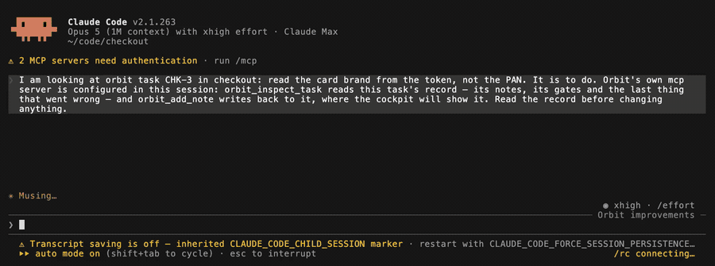

# The CLI, both ways

Orbit does not replace the CLI you already use. It hands it the terminal and
takes it back, and it talks to it over MCP while you are away.



## Hand the terminal over

`c` on a task. Your CLI — Claude Code, Codex, OpenCode, Antigravity — opens **in that
task's worktree**, carrying the task's own context and Orbit's MCP server. You
are in a normal session, in the right directory, with everything the run knows
already in front of it.

Quit it and you land back on the board. Orbit asks whether to write the
session down as a task; `y` and it is on the queue with what you just did in
it.

That is the whole point of the key. The work you do by hand and the work an
agent does are the same work, and neither should have to be re-explained to
the other.

| Key | What |
| :--- | :--- |
| `c` | open your CLI in this task's worktree |
| `t` | take the keyboard from a run that is going |
| `h` | hand it back and let the run carry on |

## Talk to Orbit from anywhere

```bash
orbit mcp install     # register in every client found
orbit mcp             # run the server on stdin/stdout
```

Twenty-two tools, so the flow goes both ways. Your CLI can:

| | |
| --- | --- |
| **write and run** | `orbit_create_task`, `orbit_retry_task`, `orbit_direct_task`, `orbit_pause_task`, `orbit_cancel_task`, `orbit_requeue_task` |
| **read** | `orbit_get_board_summary`, `orbit_list_tasks`, `orbit_inspect_task`, `orbit_list_repos`, `orbit_inspect_repo` |
| **steer** | `orbit_add_note`, `orbit_supervisor_say`, `orbit_supervisor_history` |
| **manage** | `orbit_list_flows`, `orbit_get_flow`, `orbit_save_flow`, `orbit_delete_flow`, `orbit_add_repo`, `orbit_forget_repo` |
| **teach** | `orbit_learn`, `orbit_knowledge` — see [what Orbit knows](knowledge.md) |

So the loop is: in your CLI you investigate, validate and build the plan;
from there it writes the tasks and hands them to Orbit; you open the cockpit
and let them run; and when you go back to your CLI it can read everything that
happened while you were away.

Writing a task and paying to run it stay two separate decisions.

## The other direction

The agents Orbit runs report back through the same protocol. They do not have
their stdout scraped and guessed at — they say what they did, in structured
events, which is why the record is complete enough to be worth reading in six
months.

---

Next: [the supervisor](supervisor.md) · [what Orbit knows](knowledge.md)
