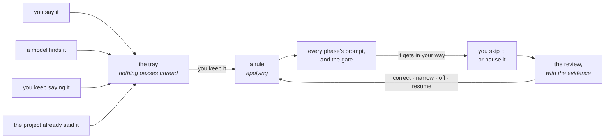

# What Orbit knows

Rules about your code that arrive in the prompt before the agent works, and
refuse the work at the gate when you give them a command. `K` in the cockpit.


## The screen

`K` in the cockpit — the Brain — is every rule Orbit holds, across every
repository on the board. It is the board's own shape: bands that say what a
rule is doing, and one line a rule.

```
  Brain  everything Orbit has learned about your code          6 rules
  Every rule is put in front of the agent before it works. The ones that
  block also run a command, and send the work back when it fails.

    ID        THE RULE                          WHERE         WHEN
  🛑 PENDING (2) ─────────────────────────────────────────────────────
  ❯ —         never push without the tests       internal/db   2026-09-14
    d42b7f60  anything that drops a column…      migrations    2026-08-12

  ⚡ BLOCKED (1) ───────────────────────────────────────────────────────
    f0021bb4  coverage stays above 90%           ledger        2026-08-12

  💬 ACTIVE (1) ────────────────────────────────────────────────────────
    a1f4c209  pull requests are written in Eng…  every repo    2026-08-12

  😴 PAUSED (1) ──────────────────────────────────────────────────────
    c0ffee11  the site is generated              web           2026-09-01

  🚫 TURNED OFF (1) ─────────────────────────────────────────────────────────
    0091ccd2  the ledger only ever appends       repo: orbit   2026-08-12
```

Five states and one set of words for them. They are adjectives and not
verbs: a state is where a rule ended up because of something somebody did to
it, so the word says how it stands rather than what it is in the middle of
doing. **Pending** is a question — a
sentence nobody has answered, or a rule that stopped you and is waiting to
be decided about. **Blocks** and **says** are the two things a rule that is
applying can do. **Paused** and **off** are the two ways it can not be.

The same word is on the rule's own screen, in the card that says where it
stands: a screen that said "told to nobody" over a rule whose card said
"switched off" was two vocabularies for one fact.

**The band is the answer**, not a column. A reader opens this screen with one
question — is there anything here for me — and two columns saying "paused"
and "no check" made them do the sorting themselves.

`↑↓` walk it, the wheel scrolls it, a click puts the cursor on a rule and a
second opens it. `↵` opens, `p` pauses, `n` writes one, `k` keeps a sentence
word for word, `d` says it was not a rule.

### One rule, opened

`↵` on a rule opens it on its own screen, built the way a task's overview is:
the strip of figures, the folding sections, the actions as a label over its
key.

```
  anything that drops a column stops for a person to look at it
  d42b7f60 · migrations · 🛑 PENDING

  │ PENDING
  it stopped you, or you paused it. Edit it with 'c', turn it on with 'u',
  or switch it off with 'o'.

  ┌ STATUS ─┐ ┌ CREATED BY ┐ ┌ CREATED ───┐ ┌ HITS ┐ ┌ REACH ────────┐
  │ PENDING │ │ you        │ │ 2026-08-12 │ │ 6    │ │ with the repo │
  └─────────┘ └────────────┘ └────────────┘ └──────┘ └───────────────┘

  ▾ WHAT IT DOES ─────────────────────────────────────────────────────
    it blocks the work · the check is make migrate-check

  ▾ WHY IT IS NOT APPLYING ───────────────────────────────────────────
    we are moving the migrations this week

  ▾ WHAT IT HAS PUT YOU THROUGH ──────────────────────────────────────
    you kept it on 12 August
    it stopped the work 4 times in test, and you got past it every time

  TURN ON [u]              SWITCH OFF [o]             EDIT [c]

  [esc] back to the list
```

Everything that cannot fit on one line of a list is here, where there is room
for it: where the rule came from, whether it travels with the repository or
stays on this machine, and the friction.

There is no count of how often it has been told, and there was one for a
while. It was never incremented, so every rule read `hits 0` whatever it had
done — but a real number would not have helped either: a rule that works
perfectly never stops anything, so a count of nothing means two opposite
things and no number tells them apart. What the card says instead is what the
rule has put you through, in sentences.

### Writing one

`n`, or `c` on an open rule, or `↵` on a sentence in the tray. It is the flow
designer's form: groups under a heading, a column of labels, and the options
of each row beside it with the one in force lit.

```
  A new rule   a sentence about your code, told to every run before it works

  THE RULE · what it says, and what it is about ──────────────────────
  ▸ What it says
      ┌──────────────────────────────────────────────────────────────┐
      │ (write the rule here)                                        │
      └──────────────────────────────────────────────────────────────┘
    Where it applies      all of orbit  cmd/ docs/ internal/ web/

  THE GATE · whether it also blocks the work, or only says it ────────
    What it does          say            block
    The check             (none yet) make check make test

      ✔ Save the rule      ✖ Leave it as it was

  the sentence every run is told before it starts work
  [tab] next row · [↑↓] move · [←→] change · [↵] do it · [esc] back
```

**The options are real.** Where a rule applies is picked from the folders the
checkout actually has, and the check from the commands its Makefile already
runs — so filing a rule is choosing rather than remembering a path and
spelling it right. Typing is still there for anything neither offers.

**The gate is a shortcut over the check**, and not a switch of its own. What
decides whether a rule blocks work is whether it has a command that answers
yes or no, so a switch beside the command could disagree with it — and a
check typed under a switch left off would be a gate somebody wrote and Orbit
threw away without saying so.

## Why not the model's memory

The model forgets between sessions, and forgets when you swap it for another
one. Every CLI keeps its own notes in its own file — `CLAUDE.md`, `AGENTS.md`
— and each of those is a silo that empties the day the engine changes.

What Orbit knows is Orbit's, kept outside all of them. Change the engine and
it still knows that the ledger only appends.

## The loop



Four ways in, one queue, and a rule that can be taken back. **Nothing reaches a
prompt without you having seen it**, and nothing is thrown away because it
annoyed you once.

## Four ways it learns

**You say it.** Tell the supervisor *"never push a pull request without the
tests passing"* and Orbit notices the sentence was a rule and offers it back.
It notices by shape — a hand-written list of openings in two languages — not
by asking a model, so it costs nothing and never surprises anybody.

**A model finds it.** An agent that hits a wall mid-task offers what it found
through `orbit_learn`. It offers; it does not write. One flow, and not two: a
rule that holds for you and not for the model is not a rule.

**You keep saying it.** The rules you mean to lay down you type. The other
half is what you would never think to say because you do not know you do it —
"add fuzz testing" at six tasks in a row is a rule nobody ever enunciated.
Orbit groups what you repeat, and a cheap model writes the rule in your words:

```bash
orbit rules repeated                    # what you keep telling runs
orbit rules draft -with claude        # and the rule it amounts to
```

**The repository already refuses it.** Whatever a pull request has to pass is,
by definition, what the project does not let through — and it is the one
source that brings a rule **with its gate already written**:

```bash
orbit rules enforced                    # or `g` on the Brain screen
```

```
go vet ./...                       go vet ./... has to pass
golangci-lint run                  golangci-lint run has to pass
make check                         make check has to pass
```

Every other source brings a sentence and leaves you to decide whether it
deserves a gate and what the gate would run. Here the command exists and has
been refusing work for years; the only thing missing was Orbit knowing about
it. So these arrive with `stops` and their command already set — and still
wait in the tray, because a project running something is not the same as
wanting Orbit to send work back over it.

Three readings, strongest first and deduplicated by command:

| | the claim |
| --- | --- |
| `.github/workflows/` | what a pull request has to pass. The strongest there is: a team that stopped meaning it would have a red branch. A workflow nothing goes through — a release, a schedule — brings nothing. |
| `.pre-commit-config.yaml`, `.husky/pre-commit`, `lefthook.yml` | what runs before a commit lands. `.git/hooks` is left alone on purpose: it does not travel, and a rule about a hook only your machine has refuses work for everybody who clones the project and has nothing to run. |
| `.golangci.yml`, `ruff.toml`, `.eslintrc*`, `.rubocop.yml`, `biome.json` | what the project is configured to lint with. The weakest: a file saying how a tool is set up does not say anything runs it — and when something does, the reading above already brought that command. |

It costs nothing and asks no model: these files either parse or they do not.

**The project already said it.** A repository with two years behind it has half
of this written down — the CONTRIBUTING, the README, and the notes each engine
keeps in its own file — and its commits say which of those are still true:

```bash
orbit rules read -with claude
```

```
process   CONTRIBUTING.md:182    Run `make check` and read its exit status before opening a PR.
style     CONTRIBUTING.md:122    Never write a hex colour outside `internal/ui/theme`.
testing   the last 362 commits   a change under internal comes with a change to a test,
                                 as 264 of the last 281 did
```

Every rule from a document points at **the line it came from**, and one the
model cannot point at a line for is thrown away: asked to summarise two years
of CONTRIBUTING, a model will produce plausible rules nobody ever wrote. Every
rule from the history carries **the count that backs it**, and a rule the file
asks for that the commits contradict is not offered at all — a sentence nobody
has held to for a year is not a rule.

It brings few and good rather than everything it can find. Forty weak offers is
a tray you stop opening, and that would take the other three sources with it.

## The tray

`orbit rules` is the one question you have when you sit down — what do I have
to decide — answered with both halves of it:

```
  1  2026-09-13 18:52  ACME-1 · model  internal/db  the migrations are generated

e2dada18 acme                 coverage stays above 90%
         the repo has never been past 80, we are fixing that first
```

The numbered ones are sentences nobody has answered; the named ones are rules
that were sent to be looked at again.

```bash
orbit rules keep 1                      # in your words, or in better ones
orbit rules keep -in internal/db 1      # and somewhere narrower
orbit rules keep -check "make test" 1   # and make it stop the work
orbit rules drop 1                      # it was not a rule
```

Filtered: `orbit rules -state active`, `paused`, `off`, `review`.

## What a rule is

```
---
id: 875c38ec
scope: dir
source: human
path: internal/db
---

the migrations are generated, never hand-edited
```

### Its name

Coined once, when Orbit first writes it, and never again — not by correcting
the sentence, not by moving the place, not by turning it off. Everything else
about a rule can change, and the file is named after what it says, so without
this nothing that comes after could tell it was the same rule.

A rule you wrote by hand has no name until Orbit writes it, and is read anyway:
a header of two lines works, because writing these by hand is half the reason
they are files.

### Where it reaches

Six, and the agent reads them in this order, so the last word goes to the one
closest to what is about to be touched:

```
every repo          "PRs are written in English"
a language          "in Go, never discard an error with _"
a repository        "this service owns no migrations"
a directory         "everything under billing/ is money; round half to even"
a file              "schema.sql is generated — edit the generator"
a symbol            "Charge() is called from the webhook and must stay idempotent"
```

Two of them — everything, and a language — are not paths at all, so they cut
across the chain instead of hanging from it.

A rule said at a run **arrives knowing where the work was**: Orbit sees which
folder the task has been changing and the sentence comes with it. Typing `-in`
wins over that, and `-in .` is how you say the whole checkout.

### Where it came from

| | |
| --- | --- |
| `human` | you said it, at a gate or in the supervisor |
| `record` | an engine worked it out mid-task |
| `docs` | the project already said it, with the file and the line |
| `history` | the commits say so, with the count |
| `gates` | the checkout already refuses work over it, with the file and the command |
| `code` | read off the map — regenerated rather than stored |

A sentence in the agent's context that nobody can trace is indistinguishable
from one the model made up, which is the whole point of keeping this outside
the model. A rule with no source does not get in.

### Whether it stops the work

A rule either says something before the work, or refuses it.

Refusing needs something that answers yes or no without an opinion in it: a
command, a pattern over the diff, a test that runs. A rule that asks to stop
and brings no check would never fire while reading as though it would — so it
only says its sentence, and the screen calls it `no check` rather than
letting it sit in the list looking like a gate.

**The command is yours and never a model's.** A check runs on every future
phase in that repository, and a wrong or slow one is an hour of a task spent on
something nobody agreed to.

### Where it stands

| | in the prompt? |
| --- | --- |
| **active** | yes |
| **paused** — stopped by you, with a reason written down | no |
| **off** — you decided against it. It stays, and stops being told. | no |

Active says nothing in the header: it is the ordinary case, and a line on every
file is a line somebody learns to stop reading.

## When a rule gets in your way

You are in the middle of something else. Two things are cheap and reversible,
and nothing else is offered:

- **skip it** — `s` on the task, or `orbit task skip`. You get past this once
  and the rule stays on.
- **pause it** — `p` on the knowledge screen, or `orbit rules pause`. It stops
  applying, and you say what for.

Either one sends the rule to be looked at again, **the first time**. Nobody
skips a rule they agree with: if you skipped it, you have already said
something without saying it.

**A pause carries its reason.** A pause with no reason is a switch, and a
switch is what forced switching a rule off when what was needed was something
else. The reason is what you read when you come back, and the only thing that
will tell you whether it made sense.

Switching a rule off and rewording it are not offered here. They decide a
rule's fate, and that is not a decision taken in a hurry with a task half done.

## Sitting down to decide

`r` on a rule in the knowledge screen, or `orbit rules review`, opens it with
everything it has put you through:

```
$ orbit rules review -rule 875c38ec
875c38ec internal/db          coverage stays above 90%
         the repo has never been past 80, we are fixing that first

  you kept it on 12 August
  it stopped the work 4 times in test, and you got past it every time
  it stopped the work twice in build, and every one was fixed
  you paused it on 9 September: the repo has never been past 80
```

**There is no score.** A rule that works perfectly never stops anything — the
model reads it and obeys — so "it stopped the work zero times" means two
opposite things and no number tells them apart. A rule is good until it annoys
you: the silence is the good case and is not measured, and what is written down
is the friction.

And there is a case no score would have understood: you asked for 90% coverage
and the repository has never been past 80. The rule is not wrong — it arrived
early. Only you know that, which is why this shows and does not decide.

Four decisions, here and only here:

```bash
orbit rules correct -rule 875c38ec -text "say it better"
orbit rules correct -rule 875c38ec -in internal/db     # narrow it to where it was true
orbit rules off -rule 875c38ec                         # decide against it
orbit rules resume -rule 875c38ec                      # have it apply again
```

**Narrowing is the one that was almost always wanted.** A rule that annoys you
in `docs` and earns its keep in `payments` is not a rule to switch off — it is
a rule about `payments` that was written too wide, and until it could be moved
the only answer was to lose it.

Nothing comes back on its own. A paused rule waits until you return to it:
maybe it made sense, maybe you were wrong, maybe you want it said differently.
Orbit does not guess.

## How much of it a run is told

Every rule that reaches the code a phase is about goes into that phase's
prompt, up to forty of them. Past forty the list is cut, and what is cut is
decided rather than incidental:

1. **Every rule a gate enforces stays.** Those are the ones that send the
   work back. A phase that never read one walks into it, and then the run
   costs an attempt to learn something the prompt could have said.
2. **Then the ones closest to the code being worked in** — the file, then the
   directory, then the checkout, then the language, then everything.

What is kept is still written widest first, because the agent reads them in
order and the narrowest rule has to be the last thing it reads.

**And the prompt says it was cut**, with the number. A prompt that quietly
dropped half of what Orbit knows would be one that claims to be the whole of
it — an agent told the list is short can ask for the rest; an agent told
nothing cannot know there was anything to ask about.

This is one of the few things in Orbit that grows on its own: it learns four
ways and keeps everything it is told. Without a ceiling, every phase of every
task pays for the whole store in tokens before it reads a line of code, and
the rules at the end of a long list are the ones a model with a full context
stops looking at — silently.

## Where all of this lives

Two places, and the question is one: **does it travel?**

| | |
| --- | --- |
| `<repo>/.orbit/knowledge/` | rules about that checkout. They travel with the push, so whoever clones the project gets them, and a rule about to start steering an agent arrives in a diff somebody reviews. |
| `$ORBIT_HOME/knowledge/` | rules about everything, and about a language. They belong to no checkout, so they stay on this machine — and the price is paid knowingly. |
| the record | what every rule has been through. |

Travelling is the whole point of the first row, so it is worth saying what
makes it true. Orbit tells your repository to ignore `.orbit/decisions/` —
its own copies of what a run decided, which are not your project's files —
and it stops there. `.orbit/knowledge/` is left alone, so a rule filed
against a checkout is committed, pushed and reviewed like anything else you
wrote.

It did not always stop there. Orbit used to exclude the whole of `.orbit/`,
which took the rules with it: a rule filed against a repository never left
the machine it was written on, and "this checkout" and "this machine" were
the same answer with two names. A checkout Orbit already touched is corrected
the next time it runs — the broad line in `.git/info/exclude` is rewritten,
not added to.

A rule's file says what is true about it today. What it has been through only
ever grows, so it is in SQLite: a history written into the file would leave a
diff in your checkout every time a gate ran.

Two sources and one story. What you did to a rule is written down when you do
it; **what the rule did is already in the task's own record**, because a gate
that refuses work writes `gate.failed` with the rule's name on it. Keeping a
second copy would be a write on every failing gate of every run, held in two
places and wrong in one of them the first time something went half way.

```bash
orbit rules history -rule 875c38ec
```

```
2026-09-13 18:52:34  kept     operator
2026-09-13 18:52:35  failed   ACME-3 · test
2026-09-13 18:52:36  failed   ACME-7 · test
2026-09-13 18:52:37  skipped  ACME-7 · test
2026-09-13 18:52:40  paused   ACME-7 · test    the repo has never been past 80
```

A gate that **passed** is not written down. A rule that works is silent and a
rule in the way is not, so what is kept is the friction.

## In the browser

`orbit web` draws the same Brain: the five bands, the tray in the first, a
rule opened with its figures and its friction, and the form with the
checkout's own folders and the Makefile's own targets in it.

It is the same verbs underneath. Every gesture on the page is `POST
/api/do/rules/<verb>` or `GET /api/read/rules/<verb>` — the paths are the
names — so the browser, the cockpit and the command line cannot drift in what
pausing a rule means or in what the record says happened.

A rule reaches the page whole: its name, its sentence, where it reaches, the
path as a form types it, where it came from, since when, what it was paused
for, and the one word for where it stands. A page handed less than that could
list a rule and not act on it.

**A verb no page names is a verb nobody can do in a browser.** That is
checked, in `internal/arch`, against the declaration — and the reasons the
twelve exceptions are exceptions are written down beside them. Routing every
verb by name and a page being able to reach one are different claims, and for
a year only the first was checked: talking to the supervisor, taking back a
line, changing a setting, reconciling and writing a task were all broken in
the browser, each answering "that is not something Orbit can be asked for".

## From the CLI you plan in

Two of Orbit's MCP tools, not shell commands — your CLI calls them once
`orbit mcp install` has registered the server. See [the CLI, both
ways](cli.md).

| Tool | What it does |
| --- | --- |
| `orbit_learn` | offer a rule about this task's code; it waits in the tray for you |
| `orbit_knowledge` | read what is already agreed before planning |

So the CLI you plan in can offer what it just worked out, and the run tomorrow
starts with it — once you have said yes.

What a model is **not** offered: pausing a rule, switching one off, correcting
one, or asking Orbit to spend money reading. A model that could pause a rule
could quietly clear away the ones it keeps running into.

---

Next: [the supervisor](supervisor.md) · [the map](map.md)
