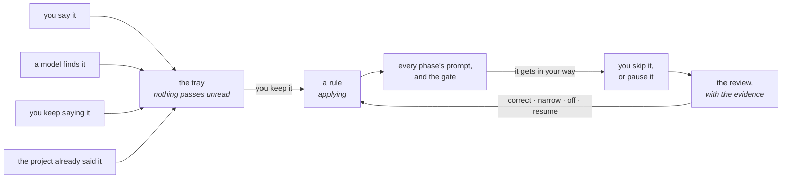

# What Orbit knows

Rules about your code that arrive in the prompt before the agent works, and
refuse the work at the gate when you give them a command. `K` in the cockpit.


## Why not the model's memory

The model forgets between sessions, and forgets when you swap it for another
one. Every CLI keeps its own notes in its own file — `CLAUDE.md`, `AGENTS.md`
— and each of those is a silo that empties the day the engine changes.

What Orbit knows is Orbit's, kept outside all of them. Change the engine and
it still knows that the ledger only appends.

## The loop



Four ways in, one queue, and a rule that can be taken back. **Nothing reaches a
prompt without you having seen it**, and nothing is thrown away because it
annoyed you once.

## Four ways it learns

**You say it.** Tell the supervisor *"never push a pull request without the
tests passing"* and Orbit notices the sentence was a rule and offers it back.
It notices by shape — a hand-written list of openings in two languages — not
by asking a model, so it costs nothing and never surprises anybody.

**A model finds it.** An agent that hits a wall mid-task offers what it found
through `orbit_learn`. It offers; it does not write. One flow, and not two: a
rule that holds for you and not for the model is not a rule.

**You keep saying it.** The rules you mean to lay down you type. The other
half is what you would never think to say because you do not know you do it —
"add fuzz testing" at six tasks in a row is a rule nobody ever enunciated.
Orbit groups what you repeat, and a cheap model writes the rule in your words:

```bash
orbit rules repeated                    # what you keep telling runs
orbit rules draft -with claude        # and the rule it amounts to
```

**The project already said it.** A repository with two years behind it has half
of this written down — the CONTRIBUTING, the README, and the notes each engine
keeps in its own file — and its commits say which of those are still true:

```bash
orbit rules read -with claude
```

```
process   CONTRIBUTING.md:182    Run `make check` and read its exit status before opening a PR.
style     CONTRIBUTING.md:122    Never write a hex colour outside `internal/ui/theme`.
testing   the last 362 commits   a change under internal comes with a change to a test,
                                 as 264 of the last 281 did
```

Every rule from a document points at **the line it came from**, and one the
model cannot point at a line for is thrown away: asked to summarise two years
of CONTRIBUTING, a model will produce plausible rules nobody ever wrote. Every
rule from the history carries **the count that backs it**, and a rule the file
asks for that the commits contradict is not offered at all — a sentence nobody
has held to for a year is not a rule.

It brings few and good rather than everything it can find. Forty weak offers is
a tray you stop opening, and that would take the other three sources with it.

## The tray

`orbit rules` is the one question you have when you sit down — what do I have
to decide — answered with both halves of it:

```
  1  2026-09-13 18:52  ACME-1 · model  internal/db  the migrations are generated

e2dada18 acme                 coverage stays above 90%
         the repo has never been past 80, we are fixing that first
```

The numbered ones are sentences nobody has answered; the named ones are rules
that were sent to be looked at again.

```bash
orbit rules keep 1                      # in your words, or in better ones
orbit rules keep -in internal/db 1      # and somewhere narrower
orbit rules keep -check "make test" 1   # and make it stop the work
orbit rules drop 1                      # it was not a rule
```

Filtered: `orbit rules -state active`, `paused`, `off`, `review`.

## What a rule is

```
---
id: 875c38ec
scope: dir
source: human
path: internal/db
---

the migrations are generated, never hand-edited
```

### Its name

Coined once, when Orbit first writes it, and never again — not by correcting
the sentence, not by moving the place, not by turning it off. Everything else
about a rule can change, and the file is named after what it says, so without
this nothing that comes after could tell it was the same rule.

A rule you wrote by hand has no name until Orbit writes it, and is read anyway:
a header of two lines works, because writing these by hand is half the reason
they are files.

### Where it reaches

Six, and the agent reads them in this order, so the last word goes to the one
closest to what is about to be touched:

```
everything          "PRs are written in English"
a language          "in Go, never discard an error with _"
a repository        "this service owns no migrations"
a directory         "everything under billing/ is money; round half to even"
a file              "schema.sql is generated — edit the generator"
a symbol            "Charge() is called from the webhook and must stay idempotent"
```

Two of them — everything, and a language — are not paths at all, so they cut
across the chain instead of hanging from it.

A rule said at a run **arrives knowing where the work was**: Orbit sees which
folder the task has been changing and the sentence comes with it. Typing `-in`
wins over that, and `-in .` is how you say the whole checkout.

### Where it came from

| | |
| --- | --- |
| `human` | you said it, at a gate or in the supervisor |
| `record` | an engine worked it out mid-task |
| `docs` | the project already said it, with the file and the line |
| `history` | the commits say so, with the count |
| `code` | read off the map — regenerated rather than stored |

A sentence in the agent's context that nobody can trace is indistinguishable
from one the model made up, which is the whole point of keeping this outside
the model. A rule with no source does not get in.

### Whether it stops the work

A rule either says something before the work, or refuses it.

Refusing needs something that answers yes or no without an opinion in it: a
command, a pattern over the diff, a test that runs. A rule that asks to stop
and brings no check would never fire while reading as though it would — so it
warns instead, and the screen says which of the two it is.

**The command is yours and never a model's.** A check runs on every future
phase in that repository, and a wrong or slow one is an hour of a task spent on
something nobody agreed to.

### Where it stands

| | in the prompt? |
| --- | --- |
| **active** | yes |
| **paused** — stopped by you, with a reason written down | no |
| **off** — you decided against it. It stays, and stops being told. | no |

Active says nothing in the header: it is the ordinary case, and a line on every
file is a line somebody learns to stop reading.

## When a rule gets in your way

You are in the middle of something else. Two things are cheap and reversible,
and nothing else is offered:

- **skip it** — `s` on the task, or `orbit task skip`. You get past this once
  and the rule stays on.
- **pause it** — `p` on the knowledge screen, or `orbit rules pause`. It stops
  applying, and you say what for.

Either one sends the rule to be looked at again, **the first time**. Nobody
skips a rule they agree with: if you skipped it, you have already said
something without saying it.

**A pause carries its reason.** A pause with no reason is a switch, and a
switch is what forced switching a rule off when what was needed was something
else. The reason is what you read when you come back, and the only thing that
will tell you whether it made sense.

Switching a rule off and rewording it are not offered here. They decide a
rule's fate, and that is not a decision taken in a hurry with a task half done.

## Sitting down to decide

`r` on a rule in the knowledge screen, or `orbit rules review`, opens it with
everything it has put you through:

```
$ orbit rules review -rule 875c38ec
875c38ec internal/db          coverage stays above 90%
         the repo has never been past 80, we are fixing that first

  you kept it on 12 August
  it stopped the work 4 times in test, and you got past it every time
  it stopped the work twice in build, and every one was fixed
  you paused it on 9 September: the repo has never been past 80
```

**There is no score.** A rule that works perfectly never stops anything — the
model reads it and obeys — so "it stopped the work zero times" means two
opposite things and no number tells them apart. A rule is good until it annoys
you: the silence is the good case and is not measured, and what is written down
is the friction.

And there is a case no score would have understood: you asked for 90% coverage
and the repository has never been past 80. The rule is not wrong — it arrived
early. Only you know that, which is why this shows and does not decide.

Four decisions, here and only here:

```bash
orbit rules correct -rule 875c38ec -text "say it better"
orbit rules correct -rule 875c38ec -in internal/db     # narrow it to where it was true
orbit rules off -rule 875c38ec                         # decide against it
orbit rules resume -rule 875c38ec                      # have it apply again
```

**Narrowing is the one that was almost always wanted.** A rule that annoys you
in `docs` and earns its keep in `payments` is not a rule to switch off — it is
a rule about `payments` that was written too wide, and until it could be moved
the only answer was to lose it.

Nothing comes back on its own. A paused rule waits until you return to it:
maybe it made sense, maybe you were wrong, maybe you want it said differently.
Orbit does not guess.

## Where all of this lives

Two places, and the question is one: **does it travel?**

| | |
| --- | --- |
| `<repo>/.orbit/knowledge/` | rules about that checkout. They travel with the push, so whoever clones the project gets them, and a rule about to start steering an agent arrives in a diff somebody reviews. |
| `$ORBIT_HOME/knowledge/` | rules about everything, and about a language. They belong to no checkout, so they stay on this machine — and the price is paid knowingly. |
| the record | what every rule has been through. |

A rule's file says what is true about it today. What it has been through only
ever grows, so it is in SQLite: a history written into the file would leave a
diff in your checkout every time a gate ran.

```bash
orbit rules history -rule 875c38ec
```

```
2026-09-13 18:52:34  kept     operator
2026-09-13 18:52:35  failed   ACME-3 · test
2026-09-13 18:52:36  failed   ACME-7 · test
2026-09-13 18:52:37  skipped  ACME-7 · test
2026-09-13 18:52:40  paused   ACME-7 · test    the repo has never been past 80
```

A gate that **passed** is not written down. A rule that works is silent and a
rule in the way is not, so what is kept is the friction.

## From the CLI you plan in

Two of Orbit's MCP tools, not shell commands — your CLI calls them once
`orbit mcp install` has registered the server. See [the CLI, both
ways](cli.md).

| Tool | What it does |
| --- | --- |
| `orbit_learn` | offer a rule about this task's code; it waits in the tray for you |
| `orbit_knowledge` | read what is already agreed before planning |

So the CLI you plan in can offer what it just worked out, and the run tomorrow
starts with it — once you have said yes.

What a model is **not** offered: pausing a rule, switching one off, correcting
one, or asking Orbit to spend money reading. A model that could pause a rule
could quietly clear away the ones it keeps running into.

---

Next: [the supervisor](supervisor.md) · [the map](map.md)
