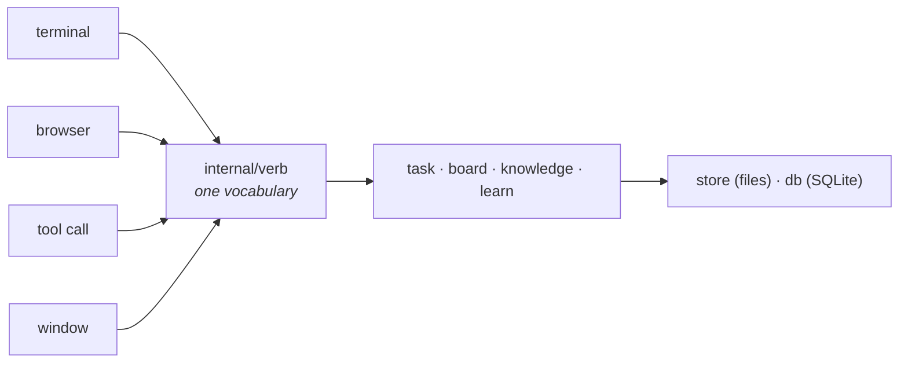

# The map

The other pages here are for somebody using Orbit. This one is for somebody
maintaining it: what the pieces are, what each one owns, and what it is not
allowed to know.

It exists because the project moves faster than anyone can read the diffs, and
a project you cannot open in three months and find your way around is one you
stop being able to change safely.

## The shape of it



Four ways in. One place that says what every action means. One record.

**Nothing about a verb is decided by the surface that asked for it.** That is
the load-bearing idea: `orbit task start`, the `n` key, `POST /api/do/task/start`
and the `orbit_task_start` tool are the same code, so they cannot drift in who
the record says did it, what happens to a run already going, or whether the
board is told to look again.

## The pieces

### The record

| | |
| --- | --- |
| `internal/record` | the vocabulary of what can happen: `task.started`, `gate.failed`, `phase.finished`. A kind is added, never removed or respelled: the log is append-only and a reader meets logs older than itself. |
| `internal/db` | SQLite. Events, runs, phases, pull requests, the tray of proposals, what happened to each rule. Migrations are add-only and ask the table what columns it has rather than trusting a version number. |
| `internal/store` | the state root: `$ORBIT_HOME`, a directory per repository, a directory per task, the worktrees. Files, not rows. |
| `internal/view` | folds a task's events into what a screen shows. One fold, so two screens cannot disagree about what happened. |
| `internal/export` | writes the record back out as JSONL. It is `internal/migrate` read backwards, and it is why SQLite is not a lock-in. |
| `internal/migrate` | fills the record from the files an older Orbit wrote. Reads, never deletes. |

### Doing the work

| | |
| --- | --- |
| `internal/repo` | git. Worktrees, diffs, branches, what a task changed. |
| `internal/flow` | the phases of a task, as data rather than as code. Adding one is writing a file. |
| `internal/engine` | the CLIs Orbit runs: claude, codex, opencode, agy. Each answers for itself where it is, what models it has, what postures it can hold and how to read its transcript. The compiler is the reviewer for a new one. |
| `internal/task` | a run: prepare the worktree, walk the phases, run the gates, write down what happened. |
| `internal/board` | walks every repository under a directory, folds every task, answers what is on screen and what changed since last time. |
| `internal/quota` | how much of an engine's allowance is left, and what a number about that engine means at all. |

### What Orbit knows

| | |
| --- | --- |
| `internal/knowledge` | a rule: a sentence about some code, with a name, a source, a place and a state. Rules are Markdown files. It imports nothing of Orbit's, because a package that could reach the record could decide things about a run. |
| `internal/learn` | the tray, and everything that happens between somebody saying a sentence and Orbit knowing it: the four ways in, what a rule has been through, and what the project's own documents say. This is the one package that reaches both the rules and the record. |

The whole loop, end to end, is [what Orbit knows](knowledge.md).

### Saying it

| | |
| --- | --- |
| `internal/verb` | every action Orbit can be asked for, declared once and done once. |
| `internal/cli` | the terminal, and the ports every way in reaches the machine through. One implementation, used by all four. |
| `internal/ui` | the cockpit. It draws and writes nothing. What it wants done goes out through a port. |
| `internal/web` | the browser. A second reader of the same fold, not a second implementation. |
| `internal/mcp` | the server a model talks to. The same verbs, minus the ones a model has no business asking for. |
| `internal/words` | two languages, one catalogue. English is the source, Spanish is beside it, and a test refuses a key that only one of them has. |
| `internal/arch` | the rules the code keeps, as tests. See below. |

## Where things live on disk

```
$ORBIT_HOME/                   ~/.orbit unless set
  orbit.db                     every event, run, phase, proposal, rule turn
  repos/<key>/                 one directory per repository
  tasks/<id>/                  the task, its notes, its artifacts
  worktrees/<key>/<id>/        the branch a task works on
  knowledge/                   rules about everything, and about a language

<your repo>/.orbit/knowledge/  rules about this checkout, these travel
```

The split is one question: **does it travel?** A rule about a repository goes
inside it, so whoever clones the project gets it and a rule about to start
steering an agent arrives in a diff somebody reviews. A rule about everything
belongs to no checkout, so it stays in the state root and the price, that
nobody else sees it, is paid knowingly.

The same question decides the rest. A rule's file says what is true about it
today and travels. What the rule has been through is of this machine, only
ever grows, and is in SQLite: a history written into the file would leave a
diff in the checkout every time a gate ran.

## The rules the code keeps

They are in `internal/arch`, as tests, so breaking one fails the build rather
than being noticed in review or not.

| | |
| --- | --- |
| **layers** | every package declares what it may import. A package not on the list fails, and adding it means writing down why. |
| **doors** | every exported name lives in a file declared as one of the package's doors. It stops a package growing a second front. |
| **the ceiling** | no `.go` file past 300 lines of code and comment. Over it, split it. |
| **the column budget** | a global count of lines past column 100, which may go down and not up. String literals are elided first, so a sentence in a message is free. |
| **one vocabulary** | every verb is offered by every way in, or the reason it is not is written down in `notThere`. A stale excuse fails too. |
| **every verb is drawn** | and the browser's own pages name every verb they can reach, or say why not in `notDrawn`. Routing a verb and a page being able to press it are different claims. Only the first was checked, and five buttons were broken for a year. |
| **what is said out loud** | a verb declares whether it spends money and whether it leaves this machine, and every surface has to say so before it asks. |
| **two languages** | a key used and not translated fails; a key translated and not used fails; English that changed without the Spanish being revisited fails. |
| **no junk drawers** | no `util`, `helpers`, `common`. No `Get` prefixes. |

If a change fights one of these, the rule is the thing to argue with, in the
comment next to it where the reason is written, and not the thing to route
around.

## Where to look when something breaks

| Symptom | Start at |
| --- | --- |
| a run did nothing, or the wrong thing | `internal/task/run.go`, then the task's `timeline` tab |
| the board shows something stale | `internal/board/refresh.go` |
| a key does nothing | `internal/ui/keymap`, then the verb behind it |
| a command and the same thing in the window disagree | they should not. `internal/verb` is the one place either can be wrong |
| the record will not open | `orbit check`. A torn record still opens so that it can be asked. |
| a rule is not reaching the prompt | `orbit rules -state active`. Paused and off do not, by design |
| the browser answers but the window does not | a port filled in `internal/cli` and not the other way round |

---

Next: [what Orbit knows](knowledge.md) · [a run, end to end](run.md)
