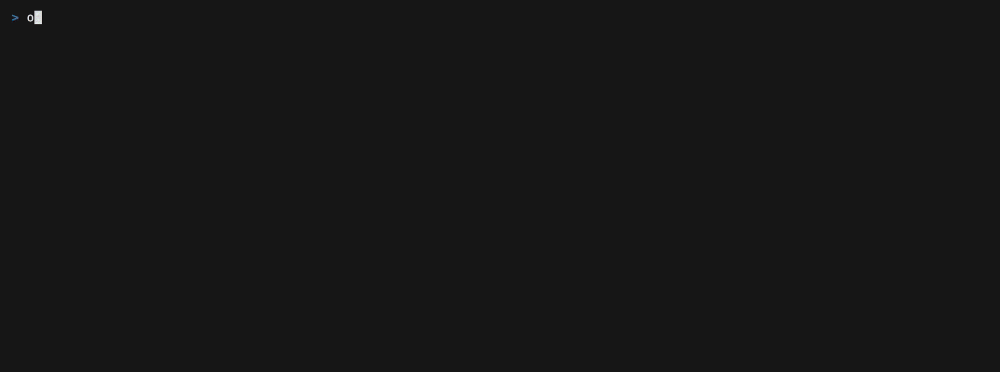

# What you can do

Press `m` on anything. That is the whole answer.



## The menu is the documentation

A cockpit with thirty keys is a cockpit where you use six. So the menu lists
every verb that applies to what the cursor is on — **and the ones that do
not**, greyed, each with the sentence saying why.

```
p   pause                pausing needs a running task; nothing is running here
r   resume               this task is already paused; press r to let it go
```

That second half is the point. A key that silently does nothing is
indistinguishable from a key that is broken, and the reader's next move is to
press it again.

## Two menus

**On the board**, `m` on a row is that task's verbs: pause, resume, skip,
cancel, put it back in To Do, mark read, delete, start a run, open a pull
request, merge it, leave a note, redirect it. On a band header, or on nothing,
it is the commands that are not about one task — the ones the `:` line
reaches.

**Inside a task**, `m` carries both blocks under a heading each: the twelve
panes with a line saying what is in each one, and under them everything that
can be done to the run. Reading a task and acting on it happen in the same
place.

## Everything else

| | |
| --- | --- |
| `?` | the full sheet: every key, and what each verb says it does |
| `:` | the command line — everything no key was given, with what it takes |
| right click | the same menu, from the pointer |

Every verb in the menu is a command you can also run from a script. The
cockpit is a keyboard in front of `orbit`, not a second copy of its rules —
which is why a refusal in the menu is word for word the refusal you get in the
terminal.

---

Reference: [every key and screen](cockpit.md) · Next: [a run, end to end](run.md)
